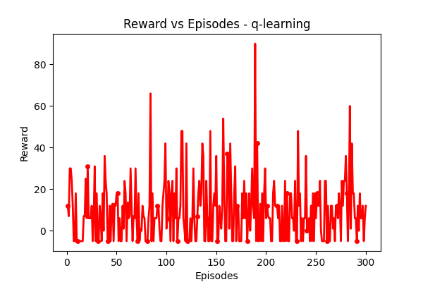

# Reinforcement Learning for Lawn Mover Problem


[**Introduction**](#introduction)

[**Enviroinment setup**](#part-1)

> [Output ](#output)
>
> [Description of environment ](#description-of-environment)
>
> [Rewards ](#rewards)
>
> [Visualization ](#visualization)
>
> [Saftey in AI ](#saftey-in-ai)

[**Methodology**](#methodology)

> [SARSA ](#sarsa)
>
> [Q-Learning](#q-learning)

[**Alpha vs Rewards**](#part-2)

> [Alpha vs Rewards](#alpha-vs-rewards)
>
> [Beta vs Rewards](#beta-vs-rewards)
>
> [Eps vs Rewards](#eps-vs-rewards)

[**Q-Learning**](#part-3---q-learning)

> [Alpha vs Rewards - q learning ](#alpha-vs-rewards---q-learning)
>
> [Beta vs Rewards - q learning ](#beta-vs-rewards---q-learning)
>
> [Eps vs Rewards - q learning ](#eps-vs-rewards---q-learning)

[**Comparison of Models**](#comparison-of-models)

> [Reward vs Episodes and No of Actions - Q Learning
> ](#reward-vs-episodes-and-no-of-actions---q-learning)
>
> [Episodes vs Rewards Per Action - Q Learning
> ](#episodes-vs-rewards-per-action---q-learning)
>
> [Reward vs Episodes and No of Actions - SARSA
> ](#reward-vs-episodes-and-no-of-actions---sarsa)
>
> [Episodes vs Rewards Per Action - SARSA
> ](#episodes-vs-rewards-per-action---sarsa)
>
> [SARSA vs Q-Learning](#sarsa-vs-q-learning)

[**Two Step SARSA**](#bonus--two-step-sarsa)

> [Implementation](#implementation)
>
> [Graphs](#graphs)


# Introduction

To generate a RL environment to simulate the lawn mover using the SARSA algorithm and Q learning algorithm

## Part 1:

## Output 
```
Current State: 0 0

Action: up

New State: 0 1 Reward: 0 Done: False

Current State: 0 1

Action: up

New State: 0 2 Reward: 0 Done: False

Current State: 0 2

Action: up

New State: 0 3 Reward: 6 Done: False

Current State: 0 3

Action: right

New State: 1 3 Reward: 0 Done: False

Current State: 1 3

Action: right

New State: 2 3 Reward: 6 Done: False

Current State: 2 3

Action: right

New State: 3 3 Reward: 100 Done: True

Reward: 12
```
## Description of environment

The canvas is first set up by the \_built_maze function, which then
constructs the grid. The create_rectangle and create_oval routines are
then used to construct the maze\'s blocks, goal, and player.
Additionally, it establishes the starting spots for the player and the
goal, respectively.

Using a point in the maze, the position_to_block function, a convenience
function, gives the start and finish coordinates of the matching block.

When the RL agent performs an action in the environment, the step
function is called. The function moves the player in accordance with an
input action (up, down, left, or right). The function gives a payout of
0 if the player runs into an obstacle.

## Rewards

-   Goal 100

-   Battery : 6

-   Rocks: -5

## Visualization


# Methodology

## SARSA

An on-policy, model-free reinforcement learning technique called SARSA
(State-Action-Reward-State-Action) is used to resolve Markov decision
processes (MDPs). Based on the present state, current action, current
reward, next state, and next action, the algorithm calculates the
predicted value of a state-activity pair. Using a temporal-difference
(TD) update rule, which considers the discrepancy between the expected
value and the actual value, the estimated values are updated. SARSA
works well for issues where the agent may interact with its surroundings
and gain knowledge by making mistakes. Initialise the Q-table with
random values, observe the current state, choose an action based on an
epsilon-greedy policy, carry out the action, observe the next state and
reward, update the Q-value based on the TD error, and so on.

## Q-Learning

The goal of the model-free reinforcement learning algorithm known as
Q-learning is to discover the best action-value function for a
particular environment. The algorithm performs actions in the
environment, observes the rewards and subsequent states, and iteratively
updates a table of action values known as the Q-table. The Bellman
equation, which explains the link between the present Q-value and the
anticipated future Q-values, is the foundation for the updates. In order
to balance discovering novel actions with using the most well-known
action, Q-learning employs an exploration-exploitation technique. As the
iterations increase to infinity, the method is guaranteed to converge to
the best Q-values.

# Part 2

## Alpha vs Rewards

| Alpha | Rewards |
|-------|---------|
| 0.1   | 6       |
| 0.2   | 12      |
| 0.3   | 6       |


Here Alpha (α) controls the rate at which the algorithm updates the
Q-values based on the observed rewards and transitions. A high value of
α means that the algorithm will update the Q-values more aggressively,
while a low value means that the updates will be more conservative. The
choice of α depends on the specific problem and the desired learning
rate.

**Inference:**

We can see that we need an optimal value of alpha to get to the final
state, a less value of alpha means the algorithms is updating the values
aggressively, So in our case 0.2 was optimal value with max rewards.

## Beta vs Rewards

 | Beta | Rewards |
|------|---------|
| 0.3  | 12      |
| 0.5  | 12      |
| 0.7  | 6       |


Beta is a hyperparameter that controls the weight given to the maximum
Q-value in the next state during the update. A high value of beta gives
more weight to the maximum Q-value, which can help to stabilize the
learning process and prevent oscillations in the Q-values.

**Inference**

In our cases, we can see that the higher values of beta (0.7) was
resulting on a reduced reward, which makes us choose the 0.5 value as
the final optimal values

## Eps vs Rewards

Epsilon (ε) is used in the exploration-exploitation tradeoff, which
refers to the balance between exploring new states and actions to learn
more about the environment, versus exploiting the current knowledge to
make the best decision. Epsilon determines the probability of taking a
random action instead of the action with the highest Q-value, which
helps the agent to explore different options.

| Eps | Rewards |
|-----|---------|
| 0.3 | 6       |
| 0.5 | 12      |
| 0.7 | 6       |


**Inference**

The higher the value of epsilon, the higher it explores the environment
by making new decisions as much as possible. However Lower epsilon means
that the model does not explore much. This is clearly visible on the
graph above where both extremely low epsilon extremely high values are
giving bad results, So we can pick the 0.5 as optimal value.

Based on our Hyperparameter tuning, we can obtain the following
Hyperparameters are optimised for best performance.

-   Alpha - 0.2

-   Beta - 0.3

-   Eps - 0.5

# Part 3 - Q-Learning

## Alpha vs Rewards - q learning

| Alpha | Rewards |
|-----|---------|
| 0.2 | 6       |
| 0.3 | 12      |
| 0.6 | 6       |


{width="6.5in"
height="4.013888888888889in"}

Here Alpha (α) controls the rate at which the algorithm updates the
Q-values based on the observed rewards and transitions. A high value of
α means that the algorithm will update the Q-values more aggressively,
while a low value means that the updates will be more conservative. The
choice of α depends on the specific problem and the desired learning
rate.

**Inference:**

We can see that we need an optimal value of alpha to get to the final
state, a less value of alpha means the algorithms is updating the values
aggressively, So in our case 0.3 was optimal value with max rewards.

## Beta vs Rewards - q learning


| Beta | Rewards |
|-----|---------|
| 0.45 | 6       |
| 0.7 | 12      |
| 0.9 | 6       |


Beta is a hyperparameter that controls the weight given to the maximum
Q-value in the next state during the update. A high value of beta gives
more weight to the maximum Q-value, which can help to stabilize the
learning process and prevent oscillations in the Q-values.

**Inference**

In our cases, we can see that the higher values of beta (0.9) was
resulting on a reduced reward, which makes us choose the 0.7 value as
the final optimal values

## Eps vs Rewards - q learning

Epsilon (ε) is used in the exploration-exploitation tradeoff, which
refers to the balance between exploring new states and actions to learn
more about the environment, versus exploiting the current knowledge to
make the best decision. Epsilon determines the probability of taking a
random action instead of the action with the highest Q-value, which
helps the agent to explore different options.


| Eps | Rewards |
|-----|---------|
| 0.1 | 6       |
| 0.3 | 12      |
| 0.5 | 6       |


**Inference**

The higher the value of epsilon, the higher it explores the environment
by making new decisions as much as possible. However, Lower epsilon
means that the model does not explore much. This is clearly visible on
the graph above where both extremely low epsilon extremely high values
are giving bad results, So we can pick the 0.3 as optimal value.

Based on our Hyperparameter tuning, we can obtain the following
Hyperparameters are optimised for best performance.

-   Alpha - 0.3

-   Beta - 0.7

-   Eps - 0.3

# Comparison of Models

## Reward vs Episodes and No of Actions - Q Learning


## Episodes vs Rewards Per Action - Q Learning


## Reward vs Episodes and No of Actions - SARSA


## Episodes vs Rewards Per Action - SARSA


## SARSA vs Q-Learning


**Inference on Comparison**

SARSA is an on policy algorithm, which means it follows policy by
choosing next action based on that policy and updates q table based on
the given action. However Q learning is an off policy algorithm. IT
learns the optimal policy by updating the Q-values based on the maximum
Q-value of the next state and all possible actions. This can make
Q-learning more efficient in terms of learning, but it can also make it
more sensitive to exploration-exploitation trade-offs and reward
shaping.

THis can also be evaluated from our models. For a fixed training
episodes, the Qlearning behaved well for a higher Beta value (because it
needs to focus more on the existing best value in the table) where as
SARSA follows the action to make the decision. However, this can lead to
additional exploration from the qlearning side which can make it highly
oscillatory as referred from the graph above.

# Bonus -Two Step SARSA

## Implementation


## Graphs


